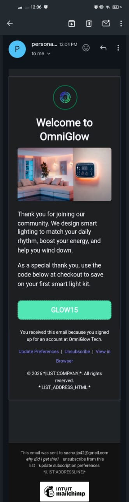

# OmniGlow Tech — Automated Welcome Email System

A high-performance, responsive automated welcome email system built with **MJML** and fully optimized for deployment within **Mailchimp**. This digital asset serves as the initial onboarding touchpoint for OmniGlow Tech's smart home lighting ecosystem, delivering a promotional discount code while guaranteeing structural stability across demanding light and dark-mode email clients.

## 🖼️ Workspace Environment Preview

Here is how your development environment should look with the live rendering extension active:



## Project Deployment Links
* **Deployment URL**: [🔗 View Live HTML Demo](https://saramx-dev.github.io/Welcome-Email-System/)
* **Source Repository**: [📁 View Source Code](https://github.com/saramx-dev/Welcome-Email-System)

## 🚀 Technical Architecture Overview

* **Framework:** MJML v4.x (Mailjet Markup Language)
* **Output Format:** Production-ready, fully inlined semantic HTML
* **Target ESP Ecosystem:** Mailchimp (Compatible with free tier campaigns & Legacy/New Builders)
* **Accessibility Standards:** Aria-label semantic tagging, strict typography scaling, and minimum color-contrast ratios.

## 📂 Project Directory Structure

```text
services-welcome-email/
├── images/
│   └── logo.png                # Raw transparent local identity asset
├── serviceWelcomeEmail.mjml    # Primary developmental source markup
├── index.html    # Compiled production HTML with inline CSS attributes
└── README.md                   # Complete repository guide, tokens, and copy deck
```

## 🎨 Asset & Design Tokens

All colors, layouts, and system typography are mapped precisely to the brand specifications:

### Color Palette
* **Primary Color**: `#6366F1` (Indigo Blue for CTA actions)
* **Secondary Color**: `#10B981` (Emerald Green for structural boundaries)
* **Base Background**: `#F1F5F9` (Light gray canvas layout)
* **Container Canvas**: `#F8FAFC` (Clean off-white card structure)

### Typography
* **Primary Text**: `-apple-system, BlinkMacSystemFont, 'Segoe UI', Helvetica, Arial, sans-serif`
* **Font Size**: `16px`
* **Line Height**: `24px` distribution

### Brand Identity Assets
* **Logo URL (Live Asset):** [https://i.ibb.co/HpqmRS72/logo.png](https://i.ibb.co/HpqmRS72/logo.png)
* **Hero Image URL:** [Unsplash Source Link](https://plus.unsplash.com/premium_photo-1728776080545-0f160cfd35c9?q=80&w=1032&auto=format&fit=crop&ixlib=rb-4.1.0&ixid=M3wxMjA3fDB8MHxwaG90by1wYWdlfHx8fGVufDB8fHx8fA%3D%3D) (Modern lit room placeholder)

## 📝 The Copy Deck

This text framework is hardcoded into the developmental source markup file:

* **Subject Line:** Welcome to the bright side! 💡 Your OmniGlow journey starts here.
* **Preview Text:** Open up for your exclusive 15% onboarding discount code.
* **Header:** Welcome to OmniGlow
* **Body Paragraph 1:** Thank you for joining our community. We design smart lighting to match your daily rhythm, boost your energy, and help you wind down.
* **Body Paragraph 2:** As a special thank you, use the code below at checkout to save on your first smart light kit.
* **Discount Code Box:** `GLOW15`
* **Call to Action (CTA) Button:** Shop the Collection
* **Footer Text:** You are receiving this because you signed up for OmniGlow updates.

## 🌓 Dark Mode Design Integration

This email utilizes advanced fluid embedded CSS overrides (`@media (prefers-color-scheme: dark)`) within the `<mj-style>` layer to target advanced environments (such as Apple Mail and Gmail iOS/Android apps) to eliminate jarring white background canvas flashes:

### Dark Mode Colors
* **Primary Dark Background**: `#121214` (Deep Charcoal Matte)
* **Card Container Background**: `#1E1E24` (Slightly lighter gray for depth separation)
* **Primary Contrast Text**: `#FFFFFF` (Pure White)
* **Muted Metadata/Footer**: `#94A3B8` (Muted Silver)

## ⚙️ ESP Data Merging & Legal Compliance

The footer contains native, clean-bound Mailchimp merge strings to dynamically communicate with Audience settings, bypassing traditional parser breaks and keeping the layout perfectly optimized:

### Mailchimp Merge Tags
* `*|CURRENT_YEAR|*` – Dynamic copyright system clock injection.
* `*|LIST:COMPANY|*` – Automates entity branding based on account settings profile.
* `*|HTML:LIST_ADDRESS_HTML|*` – Dynamic tabular rendering of the account's physical address to fully satisfy global CAN-SPAM and GDPR mandates.
* `*|MANAGE_PREFERENCES|*` / `*|UNSUB|*` / `*|ARCHIVE|*` – Fully synchronized functional links.

## 💻 Local Development & Compilation Setup

Instead of using command line tools, this project leverages the **VS Code MJML Extension** for real-time previews and instant compilation.

### Prerequisites
1. Open **VS Code**.
2. Go to the Extensions Marketplace (`Ctrl + Shift + X`).
3. Search for and install **MJML** (by gmelin).

### Development Workflow
1. Open `serviceWelcomeEmail.mjml` in VS Code.
2. **Live Preview**: Press `Ctrl + Shift + P` and select **MJML: Live Preview** to see changes in real-time.
3. **Compile to HTML**: When ready to deploy, press `Ctrl + Shift + P` and select **MJML: Export HTML**. 
4. Save the compiled output file as `index.html`.

## 📋 Mailchimp Free-Tier Import Best Practices

Because Direct HTML Template Uploads are gated behind premium paid plans, follow this alternative production roadmap to deploy this custom template for free:

1. **Copy Code**: Copy the complete compiled code inside `index.html`.
2. **Create Campaign**: Within the Mailchimp Dashboard, navigate to **Campaigns** -> **Create New** -> **Regular Email**.
3. **Design Email**: Under the **Content block** section, select **Design Email**.
4. **Select Editor**: Choose the **Code Your Own** or **Legacy Builder** interface pane and click **Paste in Code**.
5. **Paste & Configure**: Clear out any placeholder lines, paste your raw code right into the editor panel, and ensure the **CSS Inliner** option is left checked under the configuration dropdown settings to guarantee complete client render security.

***

## 👨‍💻 Author

### Sara
*Email and Landing Page Developer*

Specializing in crafting highly responsive, accessible, and conversion-optimized digital assets for remote teams. My technical focus spans across single email templates, high-converting landing pages, and complete, end-to-end campaign systems across major ESPs and CRMs (including Mailchimp, Klaviyo, and HubSpot).

#### Tech Stack & Tools
* **Languages**: HTML, CSS, JavaScript (DOM & Validation)
* **Frameworks**: MJML, Tailwind CSS
* **Design**: Figma
